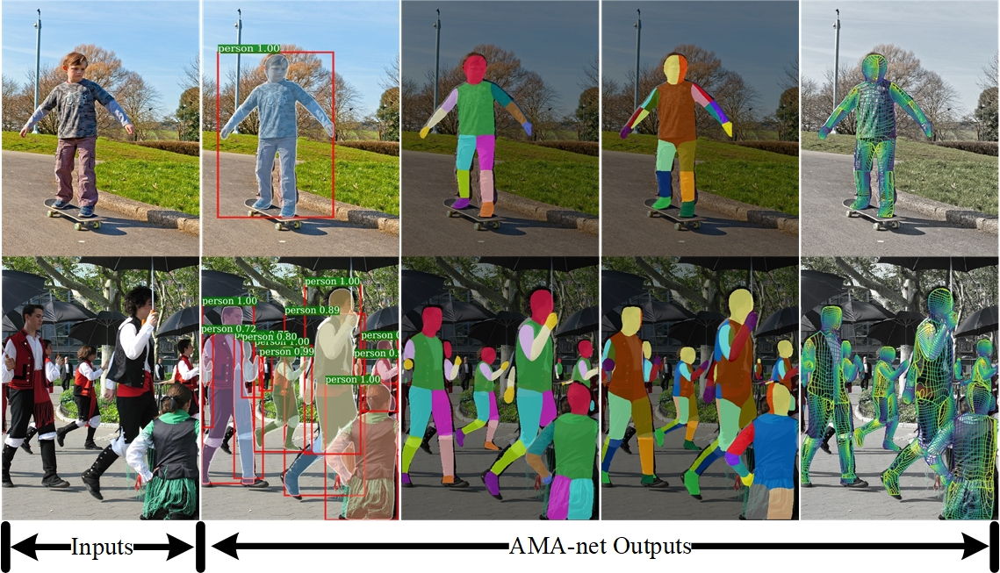

# AMA-net: 
**Adaptive Multi-Path Aggregation for Human DensePose Estimation In The Wild**

AMA-net is implemented in the [Detectron](https://github.com/facebookresearch/Detectron) framework and [DensePose](https://github.com/facebookresearch/Densepose) Project and is powered by [Caffe2](https://github.com/caffe2/caffe2).
In this repository, we provide the code to train and evaluate AMA-net. 

  

## Installation

Please find installation instructions for Caffe2 and DensePose in [`INSTALL.md`](INSTALL.md), a document based on the [Detectron](https://github.com/facebookresearch/Detectron) installation instructions.

## Inference-Training-Testing

After installation, please see [`GETTING_STARTED.md`](GETTING_STARTED.md)  for examples of inference and training and testing.

